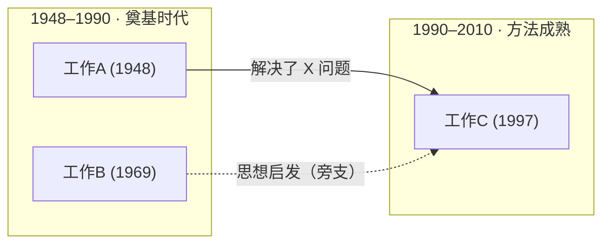
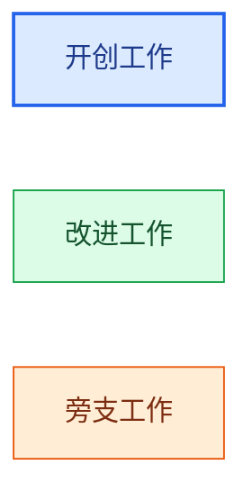
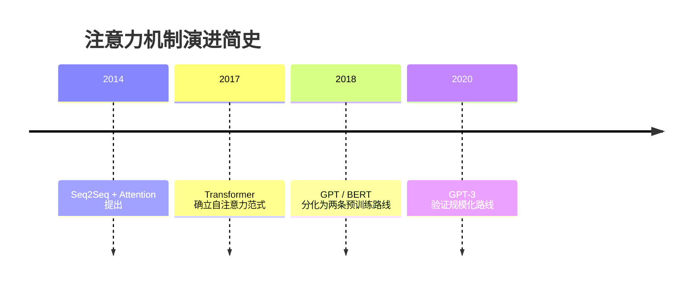
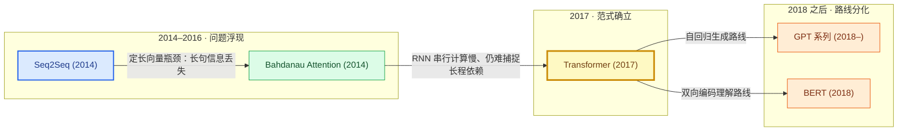

# Mermaid 谱系图语法模式与高频坑

绘制研究谱系图前必读。目标是**一次写对可被 GitHub / mermaid.live / Typora 直接渲染**的 Mermaid 代码。

## 1. 主图骨架（flowchart）

统一使用 `flowchart`（不用旧式 `graph`），方向：节点少、按年代推进用 `LR`；分支多、年代泳道纵向排列用 `TD`。

要点：
- `subgraph ID["标题"]`：标题含空格、中文标点、破折号时**必须加双引号**。
- 每个 `subgraph` 必须有配对的 `end`。
- `direction TB` 写在 subgraph 内部首行，控制泳道内节点排列方向。

## 2. 节点规则

- **节点 ID**：只用字母、数字、下划线（如 `Attention2017`），不得含空格、连字符、点号。
- **节点文字（label）**：一律用双引号包裹，如 `Transformer2017["Transformer (2017)"]`。label 内含 `()[]{}:;&#|` 等字符时引号可保平安；不加引号是谱系图最常见的渲染失败原因。
- **年份进 label**：每个节点文字末尾带年份，如 `"BERT (2018)"`，保证图本身自含时间信息。
- 形状约定：默认矩形 `["..."]` 即可；范式开创者可酌情用六边形 `{{"..."}}` 或圆角 `("...")` 加以区分，但全图形状语义要一致。

## 3. 演进边模式（"问题 → 解决"的载体）

| 语义 | 语法 | 示例 |
|---|---|---|
| 直接演进（解决了前人的问题） | `A -->|"解决了什么问题"| B` | `RNN -->|"长程依赖丢失"| LSTM` |
| 范式确立 / 重大跃迁 | `A ==>|"确立新范式"| B` | 粗箭头，慎用，全图 ≤3 条 |
| 旁支启发 / 弱关联 | `A -.->|"启发"| B` | 虚线，用于跨分支影响 |
| 同属关系（无问题叙事时少用） | `A --- B` | 尽量避免，谱系图的边应当有叙事 |

边标签写作要求：动词开头、一句话说清"解决了什么"，如 `"解决梯度消失"`、`"算力瓶颈：O(n²) 注意力"`。避免只写"改进""引用"。

## 4. 配色语义（classDef）

全图配色语义固定，便于读者建立心智模型（浅色底适配亮色查看器）：

- `pioneer`（蓝）：范式开创 / 问题首次被提出
- `improve`（绿）：沿主线解决前人问题的改进工作
- `branch`（橙）：旁支路线
- `milestone`（黄，加粗边）：公认的里程碑节点，可与主线色二选一使用
- `classDef` 定义必须出现在图中（建议放图尾），用 `:::类名` 内联挂载或 `class 节点ID 类名` 语句挂载。

## 5. 高频坑清单（按出现频率排序）

1. **label 未加引号**且含括号/冒号/`#`/`&` → 解析失败。修复：`ID["..."]` 全量加引号。
2. **节点 ID 非法**：含空格、`-`、`.`。修复：纯 `[A-Za-z0-9_]`。
3. **subgraph 标题未加引号**：`subgraph 2017 年` 会失败，应写 `subgraph E1["2017 年"]`。
4. **subgraph / end 不配对**：每个 `subgraph` 一个 `end`，嵌套时注意层次。
5. **重复定义同一节点 ID 但 label 不同**：后定义覆盖先定义，边会连到意外节点。同一节点只定义一次 label，后续直接用 ID 连边。
6. **边标签里出现 `|`**：会截断标签，改用中文竖线"｜"或去掉。
7. **linkStyle 索引错位**：边的索引从 0 开始按出现顺序计数，极易数错。谱系图一律不用 linkStyle，节点颜色交给 classDef。
8. **中文全角括号`（）`**：在引号内安全；无引号时同样危险，故统一加引号。
9. **注释**：用 `%% 注释内容`，不要写 `//` 或 `#`。
10. **图过大**：单图节点 >20 时渲染拥挤且查看器缩放体验差，拆分为总览图 + 分支子图。

## 6. timeline 备选简版

文末可附时间线速览（语法简单，注意每行 `年份 : 事件`，冒号两侧空格）：

## 7. 完整最小示例（注意力机制谱系节选）

