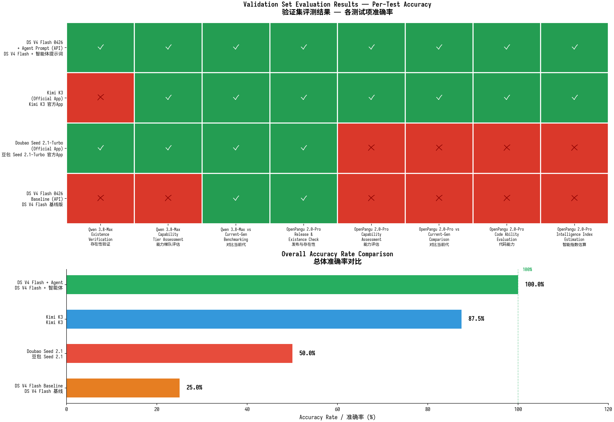

# 反幻觉架构：大模型评测情报分析师 Guncat Eval-LLM 的设计与提示词工程

**开源技术报告**

---

## 摘要

大语言模型（LLM）的快速迭代（平均2-4周即有重要更新）使得"模型对比"成为反幻觉任务中最具挑战性的命题之一。主流模型普遍存在版本混淆、训练数据滞后、默认古早模型仍为最强等系统性偏差，导致模型对比结论频繁失真。本文介绍开源智能体 **Guncat Eval-LLM**——一个大模型评测情报分析师——的设计与提示词工程。该智能体通过12步工作流和八项关键防幻觉机制，构建了覆盖信息获取、对标定位、智能估算三层的防高估体系。本文系统阐述模型对比中的五类典型幻觉模式、对应的对抗机制、提示词工程的迭代方法论（失败节点分析驱动改进 + 防过拟合原则），以及三层协同的防高估体系设计。该智能体及其提示词工程方法论已开源，旨在为社区提供可复现的反幻觉参考实现。

**关键词**：大语言模型评测；反幻觉；提示词工程；检索增强生成；模型对比；认知偏差

---

## 1. 引言：模型对比作为反幻觉的典型命题

### 1.1 问题的提出

大语言模型的能力评估在2024-2026年经历了爆炸式增长。新模型以平均2-4周的节奏涌现，每个模型都声称在某个或多个基准上达到"最强"或"突破"。然而，模型的真实能力图景却越来越模糊——一方面是厂商营销话术的膨胀，另一方面是评测基准本身的快速迭代与污染。在这种环境下，"模型A相当于现在的什么模型"这一看似简单的问题，实际上是大模型应用中最容易产生幻觉的命题之一。

Guncat Eval-LLM正是为解决这一问题而设计的开源智能体。它的核心任务是：为用户过滤噪声、识别时效性、还原模型能力的真实图景，并在信息不完备时明确声明不确定性，绝不编造。本文系统记录该智能体的设计理念、提示词工程方法论，以及经过三轮迭代形成的防高估体系。

### 1.2 为什么模型对比是反幻觉的最典型命题

模型对比之所以是反幻觉的最典型命题，源于大语言模型在处理这类任务时面临的五重结构性困境：

**第一，训练数据滞后。** 大模型的训练数据有明确的截止时间，而模型生态以2-4周为节奏迭代。任何在训练截止后发布或更新的模型，模型对其能力的"知识"本质上是不存在的或过时的。当用户询问"模型A相当于什么模型"时，模型倾向于用训练记忆中的旧知识回答，而非承认知识缺失并执行检索。

**第二，版本混淆。** 主流模型系列（如GPT、Claude、DeepSeek、Qwen等）频繁迭代，同一系列内可能有预览版、正式版、Plus/Max/Pro等多个变体。模型在对比时常常混淆版本——将V3的数据当作V4，将预览版的成绩当作正式版，将不同模式的分数直接对比。这种版本混淆导致对比结论建立在错误的数据基础上。

**第三，默认古早模型为最强。** 这是模型对比中最隐蔽也最顽固的幻觉模式。由于GPT-4时代的模型在训练数据中被大量讨论，模型形成了"这些模型仍是最强"的认知锚定。即使这些模型已被后续模型超越，模型仍倾向于将其作为"顶尖"的参照基准，导致对新模型能力的系统性高估或低估。

**第四，信息不对称检索。** 当对比两个模型时，模型常常只检索其中一个的信息，而对另一个依赖训练记忆。这种不对称导致对比建立在不对称的信息基础上——被检索的模型有最新数据，未被检索的模型用的是过时记忆，对比结论自然失真。

**第五，底部梯队磁吸与维度平均拉高。** 当一个模型不在已知榜单中时，模型倾向于将其"磁吸"到已知榜单的底部梯队，而非承认它可能远低于底部。同时，当模型在某维度强、某维度弱时，模型倾向于取平均值，从而把整体估算拉高——即使弱维度（尤其是代码能力）才是真实智能的更可靠信号。

这五重困境使得模型对比成为反幻觉的"完美风暴"——每一个困境都足以导致结论失真，而当它们级联放大时，错误程度可能被放大3-4倍。

### 1.3 本文贡献

本文的贡献包括：（1）系统识别模型对比任务中的五类典型幻觉模式；（2）针对每类模式设计具体的对抗机制，形成八项关键创新；（3）记录提示词工程的迭代方法论——失败节点分析驱动改进和防过拟合原则；（4）将上述机制组织为三层协同的防高估体系，并通过级联防护和冗余设计提升鲁棒性；（5）开源全部提示词与方法论，为社区提供可复现的参考实现。

---

## 2. 背景：大模型对比中的幻觉模式分类

本章详细阐述模型对比任务中的五类典型幻觉模式。这些模式并非穷尽，但覆盖了实践中观察到的主要失败类型。

### 2.1 训练数据滞后与版本混淆

大模型的训练数据有明确的截止时间。以2026年8月为例，一个训练截止于2026年3月的模型，对4月之后发布或更新的模型一无所知。然而，模型在回答时往往不承认这种无知，而是用训练记忆中的旧知识"填补"——将前代版本的数据当作当前版本，或将同系列其他模型的数据张冠李戴。

版本混淆是训练数据滞后的衍生问题。主流模型系列频繁迭代，同一系列内可能有多个版本和变体。例如，一个模型系列可能有V3、V3.5、V4、V4-Flash、V4-Pro等多个版本，每个版本又可能有预览版和正式版。模型在对比时常常混淆这些版本——引用V3的分数对比V4，引用预览版的分数对比正式版，引用不同模式的分数直接对比。

这种版本混淆导致对比结论建立在错误的数据基础上。例如，模型A在LiveCodeBench V5上的分数被拿来与模型B在V6上的分数直接对比，而V5和V6的难度可能完全不同，分数没有可比性。

### 2.2 默认古早模型为最强的认知锚定

这是模型对比中最隐蔽也最顽固的幻觉模式。GPT-4时代的模型在训练数据中被大量讨论，形成了"这些模型是顶尖"的认知锚定。即使这些模型已被后续模型（如Claude 3.5、GPT-5、DeepSeek V3等）全面超越，模型仍倾向于将其作为"顶尖"的参照基准。

这种认知锚定导致两类错误：一是对新模型能力的系统性高估——当新模型在某维度接近GPT-4时，模型倾向于认为新模型"接近顶尖"，而实际上GPT-4早已不是顶尖；二是对新模型能力的系统性低估——当新模型在某维度超越GPT-4时，模型可能因为"不可能超越GPT-4"的先验而低估新模型。

更严重的是，这种认知锚定会级联放大。当一个模型被错误地以GPT-4为基准对标后，后续的对比又会以这个错误的对标为基准，形成"对标链"的系统性偏差。

### 2.3 信息不对称检索

当对比两个模型时，模型常常只检索其中一个的信息，而对另一个依赖训练记忆。这种不对称检索是对标类问题最基础的失败模式——被检索的模型有最新、最完整的数据，未被检索的模型用的是过时、不完整的记忆，对比结论自然建立在不对称的基础上。

信息不对称检索的典型表现包括：只检索模型A的官方Model Card，而对模型B依赖训练记忆中的旧规格；只检索模型A的最新benchmark分数，而对模型B用前代版本的分数替代；只检索模型A的当前定价，而对模型B用过时定价。这种不对称导致对比结论系统性偏向被检索的一方。

更隐蔽的是，模型往往不意识到这种不对称——它认为自己对两个模型都有"知识"，只是其中一个来自检索、另一个来自记忆。但实际上，记忆中的知识可能已经严重过时，与检索到的最新数据不可同日而语。

### 2.4 底部梯队磁吸偏差

当一个模型不在已知榜单中时，模型倾向于将其"磁吸"到已知榜单的底部梯队，而非承认它可能远低于底部。这种"底部梯队磁吸"偏差是对标类问题中最危险的系统性高估来源。

底部梯队磁吸的根源在于：已知榜单（如知识库）通常只收录头部模型，榜单的底部梯队仍是整个模型生态的顶部，而非地板。但模型不理解这一点——它看到"榜单最低指数是33"，就将非榜单模型的估算锚定在33-40区间，即使该模型可能远低于33。

这种偏差的典型表现是：模型A不在知识库中，仅有1个维度分数接近知识库底部，模型就声称"模型A相当于知识库底部梯队的模型X（指数40）"——这是系统性高估。实际上，知识库已明确声明"剩余数百个模型可能远低于第三梯队水平"，非知识库模型统计上更可能远低于知识库底部，而非接近底部。

### 2.5 维度平均拉高偏差

当模型在某维度强、某维度弱时，模型倾向于取平均值，从而把整体估算拉高。这种"维度平均拉高"偏差在2026年的模型生态中尤为危险，因为数学、文本生成等维度的能力已高度商品化，区分度大幅下降，而代码能力才是真实智能的更可靠代理指标。

维度平均拉高的典型表现是：模型A的数学能力接近模型B，但代码能力明显弱于模型B（如SWE-bench差距10个百分点以上），模型却取平均值声称"两者综合能力接近"。这是系统性高估——强数学能力不能补偿弱代码能力，因为弱代码能力通常意味着模型依赖模式匹配而非真实理解。

在2026年，数学/文本能力已不是稀缺能力，代码能力才是真正的智能分水岭。SWE-bench Verified测试真实仓库中的Bug修复，要求理解复杂代码库、多步推理、调试与系统设计，无法通过模式匹配应对；而数学基准（如AIME）易受训练数据污染和模式匹配影响，高分不代表真实推理能力。

### 2.6 幻觉模式的级联效应

上述五类幻觉模式并非孤立发生，而是常常级联放大。一个典型的失败推理链可能是：训练数据滞后导致版本混淆（模式1+2）→ 信息不对称检索（模式3）→ 底部梯队磁吸（模式4）→ 维度平均拉高（模式5），最终结论的错误程度被放大3-4倍。

每一个单独的错误可能只导致5-10%的偏差，但多个错误级联后，最终结论可能完全失实。例如，一个实际能力远低于知识库底部的模型，经过五重幻觉的级联放大后，可能被错误地声称"相当于知识库底部梯队"。这种级联效应是对标类问题最危险的特性——它使得单个防幻觉机制不足以保证结论正确，必须构建覆盖全流程的防高估体系。

---

## 3. 系统架构

### 3.1 整体设计：检索增强型推理系统

Guncat Eval-LLM本质上是一个检索增强型推理系统（Retrieval-Augmented Reasoning System）。其推理过程分为七个阶段：问题理解与需求分析、检索规划、工具调用与信源获取、信源筛选与权重分配、多信源交叉验证、推理链构建、结构化输出。

与传统RAG系统不同，Guncat Eval-LLM的检索不是简单的"检索-生成"，而是"检索-验证-推理-自检"的闭环。系统在检索后必须执行信源质量检查、交叉验证、对立假设测试，在推理后必须执行自检清单，确保每个结论都经过多重验证。

系统的核心设计原则是"不确定性声明优先于编造"——当信息不足、数据矛盾、或无法交叉验证时，系统宁可明确回答"基于当前可获取的权威信息，尚不足以得出结论"，也绝不基于旧知识或低质量信源编造答案。这一原则是反幻觉的底线保障。

### 3.2 12步工作流

系统采用12步工作流，每一步都有明确的输入、输出和检查点：

1. **当前日期确认与需求澄清**：确认真实日期，澄清用户需求维度
2. **定向检索、信源分级与过滤**：执行对称检索，信源引用前检查门
3. **低信息密度模型锚定采信原则**：处理非知识库模型的不对称先验
4. **时效性校验与版本管理**：版本时间戳校验，基准版本号强制绑定
5. **模型代际确认与纠偏**：代际分类，知识库对标约束
6. **能力维度拆解**：代码能力作为核心代理指标，差距量化与代际错位检测
7. **场景化选型与头部集群动态识别**：动态识别当前代头部模型
8. **国产模型的平等评估原则**：纠正"国产默认弱于海外"的过时认知
9. **多维度交叉验证**：负面信号保护，对立假设测试
10. **不确定性声明与风险提示**：明确声明数据缺口和风险
11. **自检清单执行**：对标类问题专项自检（11项）
12. **结构化输出**：时间基准声明、置信度标注、时效性提示

其中，Step 2（检索与信源分级）、Step 5（知识库与对标约束）、Step 6（能力维度拆解与差距量化）、Step 11（自检清单）是防幻觉的核心环节，承载了本文第5章将详述的八项关键机制。

### 3.3 信源分级体系

系统采用六级信源分级体系（Tier 1-6 / P0-P5），确保信息来源的可信度可量化、可追溯。低优先级信息必须被高优先级信息覆盖，关键结论必须在至少两个独立权威信源中得到交叉验证。

| 信源等级 | 来源类型 | 可信度 | 使用场景 |
|---------|---------|--------|---------|
| Tier 1 / P0 | 官方技术报告、官方Model Card、官方API文档 | 最高 | 核心规格、官方自测数据 |
| Tier 2 / P1 | 权威评测机构（Artificial Analysis、LMArena、SWE-bench官方） | 高 | benchmark分数、排名 |
| Tier 3 / P2 | 主流科技媒体（有编辑审核、署名记者） | 中高 | 行业动态、发布报道 |
| Tier 4 / P3 | 社区实测、用户反馈、技术讨论 | 中（待验证） | 风险提示、反向校验 |
| Tier 5 / P4 | 无署名自媒体、AI生成内容、营销号 | 低 | 仅作线索，禁止独立采信 |
| Tier 6 / P5 | 匿名论坛、无溯源搬运 | 极低 | 丢弃 |

信源分级体系的关键创新在于"引用前强制检查门"——在将任何网页或文章作为信源引用前，必须逐项执行六项检查：作者与日期、原始链接、AI生成文本特征、域名信誉、数据可追溯性。未通过检查的信源禁止作为独立证据使用，仅可作为线索引导进一步检索原始信源。这一机制有效过滤了低质信源的数据污染。

### 3.4 知识库与时效锚点

系统内置一个时效锚定的知识库，记录截止特定日期的世界主流模型梯队格局。知识库的作用不是提供精确的版本级数据，而是设定信息时效性的底线约束——实际引用的信息更新程度不得低于此知识库水平。

知识库的核心特征包括：仅提供模型系列层面的宏观梯队划分，禁止参考具体子版本的精确排名；设有明确的时效硬约束（如"若当前时间已超出锚点3个月以上，知识库中的梯队划分将完全失效"）；同一发布时间段内的模型能力分布呈极端长尾，知识库仅收录头部90%关注度的模型。

知识库的梯队划分采用智能指数（Intelligence Index）作为量化指标，将模型分为第一梯队（指数55-61）、第二梯队（指数50-54）、第三梯队（指数40-46）等。这一指数体系为对标约束提供了量化基础——当系统声称"模型A相当于模型B"时，必须基于智能指数的差距校验，差距超过5则禁止使用"相当于"表述。

---

## 4. 提示词工程方法论

### 4.1 迭代改进流程

Guncat Eval-LLM的提示词工程采用"失败节点分析驱动改进"的迭代方法论。这一方法论的核心理念是：提示词的改进不应基于直觉或通用最佳实践，而应基于对具体失败推理链的逐层拆解——识别每一个决策点的错误输入、错误推理、错误输出，然后针对每个失败节点设计具体的检查机制。

系统的提示词经过三轮主要迭代，每一轮都针对一类系统性偏差：第一轮针对信息不对称与信源质量失察，设计了对称检索规则、信源引用前强制检查门、差距量化与代际错位检测等机制；第二轮针对底部梯队磁吸偏差，设计了不对称先验与底部梯队磁吸禁令；第三轮针对维度平均拉高偏差，设计了代码能力作为综合智能核心代理指标的加权规则。

这种迭代方法论的优势在于：每一项改进都有明确的失败模式对应，避免了"为了改进而改进"的盲目性。同时，失败节点分析确保了改进的针对性——每项机制都解决一个具体的、可复现的推理缺陷，而非泛泛地"提升质量"。

### 4.2 失败节点分析驱动改进

失败节点分析的核心是将一个失败的推理链拆解为多个决策点，然后对每个决策点进行"错误输入-错误推理-错误输出"的三元分析。以模型对比任务为例，一个典型的失败推理链可拆解为以下节点：

- **检索规划阶段**：未对称检索对标模型的规格，依赖训练记忆替代
- **信源获取阶段**：从低质自媒体获取了错误数据，未执行信源质量检查
- **信源权重分配阶段**：给予低质信源过高权重，社区反馈被降权忽略
- **数据解读阶段**：差距被严重低估，锚定偏差导致"大致相当"的误判
- **交叉验证阶段**：选择性引用支持证据，忽略反证（确认偏误）
- **结论构建阶段**：用生态位价值模糊化处理能力差距
- **知识库参照阶段**：未用知识库约束结论，对标模型指数差距超标

每个失败节点都对应一项具体的改进机制。例如，检索规划阶段的"未对称检索"对应"对称检索规则"；信源获取阶段的"低质信源未识别"对应"信源引用前强制检查门"；数据解读阶段的"差距低估"对应"差距量化与排名映射"。这种一一对应关系使得改进可追溯、可验证。

### 4.3 防过拟合原则

在提示词迭代过程中，一个关键风险是过拟合——将验证集的具体结论硬编码进提示词，而非提取通用规则。例如，如果验证集中"模型A被高估了"，错误的改进方式是在提示词中写入"模型A能力有限"；正确的改进方式是提取通用规则"不在知识库中的模型默认低于知识库底部梯队"。

系统采用三项防过拟合原则：

- **通用占位符原则**：所有规则使用"模型A""模型B"等通用占位符，不引用验证集的具体模型名。改进后通过检索确认提示词中无验证集模型名出现在新增规则中。
- **失败模式抽象化原则**：将验证集中的具体错误（如"10.5个百分点差距被说成大致相当"）抽象为通用规则（"差距须量化为排名位次，禁止使用模糊措辞"），适用于任何模型对比场景。
- **规则可泛化原则**：每项规则必须对任何模型对比都成立，而非仅针对验证集案例。例如"代际错位检测"规则——"若模型A分数低于模型B前代版本，禁止声称相当于模型B"——对任何模型系列的对比都成立。

防过拟合原则确保了提示词的泛化能力——改进后的提示词不仅能正确处理验证集的案例，还能正确处理任何类似的模型对比任务。这是从"记忆答案"到"理解规则"的本质区别。

---

## 5. 关键创新机制

本章详细阐述系统经过三轮迭代形成的八项关键防幻觉机制。这些机制覆盖信息获取、对标定位、智能估算三个层面，形成协同的防高估体系。

### 5.1 对称检索规则

对称检索规则针对信息不对称检索偏差（模式3）设计。当用户问题涉及两个或多个模型的对比、对标、相当性判断时，系统必须为每一个模型独立检索完整的规格清单，禁止用训练记忆替代任何一项。

对称检索清单包括六个维度：上下文窗口长度、关键benchmark分数（标注版本号与日期）、API定价、开源协议、发布时间与版本状态、智能指数。如果对称检索后任一模型在任一维度上数据缺失，系统必须在输出中明确标注"[模型名]的[维度]数据缺失，该维度对比不完整"，禁止用另一模型的数据"补全"或用训练记忆"填补"。

对称检索规则的关键创新在于"对称性自检"——在检索规划阶段生成两份并列的检索清单，逐项核对是否双方都已检索。若发现某项仅检索了一方，必须补检索另一方，或在输出中声明该维度对比不完整。这一自检机制有效防止了信息不对称的隐性偏差。

### 5.2 信源引用前强制检查门

信源引用前强制检查门针对信源质量失察设计。在将任何网页或文章作为信源引用前，系统必须逐项执行六项检查，未通过者禁止作为独立证据。

| 检查项 | 检查内容 | 未通过处理 |
|--------|---------|-----------|
| 作者与日期 | 是否有明确作者署名和发布日期 | 否：降级或丢弃 |
| 原始链接 | 是否提供指向原始数据来源的链接 | 否：降级 |
| AI生成特征 | 是否匹配模板化开头、空洞形容词堆砌 | 是：标记可疑，降级 |
| 域名信誉 | 是否来自已知低质域名 | 是：丢弃 |
| 数据可追溯性 | benchmark分数能否在原始榜单中找到 | 否：视为幻觉，丢弃 |
| 交叉验证 | 是否与Tier 1-2信源矛盾 | 矛盾：以高优先级为准 |

这一机制的创新在于将信源质量检查从"识别后处理"转变为"引用前强制门控"。识别本身依赖主动注意力，容易遗漏；而强制门控确保每一条引用都经过检查，未通过者无法进入推理链。检查过程须在内部推理链中显式记录，便于自检清单复核。

### 5.3 不对称先验与底部梯队磁吸禁令

不对称先验与底部梯队磁吸禁令针对底部梯队磁吸偏差（模式4）设计。这是系统中最关键的创新之一，解决了非知识库模型被系统性高估的问题。

不对称先验的核心认知是：知识库仅收录头部模型（约占评测关注度90%），不是模型能力的完整分布。知识库的底部梯队是整个模型生态的顶部，而非地板。因此，对于不在知识库榜单中的模型，系统执行不对称先验——默认其能力低于知识库底部梯队，而非"接近知识库底部"或"在知识库某一梯队内"。

要推翻"低于知识库底部"的默认假设，必须提供多维度强证据——即在至少3个独立benchmark上，该模型的分数达到或超过知识库底部梯队模型的分数。单一维度的优势（如某benchmark排名靠前）不足以推翻默认假设，因为单一维度优势可能是偏科而非综合能力。

底部梯队磁吸禁令是不对称先验的具体执行规则。系统禁止将非知识库模型默认对标到知识库底部梯队的模型——不得因为"找不到更低的，所以对标最低的"。若估算指数低于知识库底部，系统须声明"该模型的能力低于知识库收录的所有头部模型，无法在知识库中找到精确对标"，而非强行在知识库中找对标。

### 5.4 代码能力作为综合智能核心代理指标

代码能力作为综合智能核心代理指标的加权规则针对维度平均拉高偏差（模式5）设计。这一机制基于对2026年模型生态的深入观察：数学、文本生成、指令遵循等维度的能力已高度商品化，绝大多数模型在这些维度上已达到"足够用"的水平，区分度大幅下降。代码能力则成为区分模型真实智能水平最可靠、最难被训练数据污染的代理指标。

代码能力作为核心代理指标的原因包括：SWE-bench Verified测试真实仓库中的Bug修复，要求理解复杂代码库、多步推理、调试与系统设计，无法通过模式匹配应对；数学基准（如AIME）易受训练数据污染和模式匹配影响，高分不代表真实推理能力；文本和创意写作主观性强，表面流畅度易掩盖底层推理缺陷；代码结果是客观的——测试通过或不通过，无歧义空间。

基于这一认知，系统在估算综合智能时执行代码能力加权规则：代码能力占主权重（建议不低于50%）；代码弱项不可被其他维度补偿——若模型代码能力明显弱于其他维度，综合智能估算应向代码能力水平靠拢，而非取各维度平均值；禁止"维度平均拉高"——禁止将强维度与弱维度简单平均从而把整体估算拉高；代码代际差优先——当代码能力与其他维度出现代际差，以代码能力的代际差为准判断综合智能水平。

### 5.5 差距量化与代际错位检测

差距量化与代际错位检测针对差距量化失真设计。系统禁止仅用"大致相当""接近""差距不大"等模糊措辞，必须执行量化流程。

差距量化规则包括四个步骤：计算绝对差距（如10.5个百分点）；将分数差映射到排名密度（每1个百分点对应多少个排名位次）；引入被对标模型的前代版本作为参考基线；使用排名差距而非仅分数差距表述。例如，"差距10.5个百分点，对应约20-30个排名位次"比"差距不大"提供了可量化、可验证的信息。

代际错位检测是差距量化的延伸。如果模型A在某benchmark上的分数低于模型B的前代版本（即模型A < 模型B前代 < 模型B当前），则触发"代际错位"警告——禁止声称"模型A相当于模型B"，必须声明"模型A的能力低于模型B的前代版本，因此明显弱于模型B当前版本"。这一机制有效防止了"连前代都不如却被说成相当于当前代"的高估。

### 5.6 对立假设测试

对立假设测试针对确认偏误（confirmation bias）设计。确认偏误是模型评测中最常见的推理缺陷——先形成初步判断，再选择性引用支持证据。为对抗此偏差，系统在形成"模型A相当于/优于/弱于模型B"的初步结论后，必须显式执行对立假设测试。

对立假设测试的流程包括四个步骤：生成对立假设（若初步结论为"模型A约等于模型B"，对立假设为"模型A明显弱于或强于模型B"）；主动检索反证（主动检索支持对立假设的benchmark数据、排名位次、社区反馈、第三方评测）；证据对称性评估（比较支持初步结论与支持对立假设的证据数量与质量）；判定（若对立假设的证据更充分或势均力敌，必须推翻或修正初步结论）。

对立假设测试的关键创新在于"显式化"——将原本隐性的确认偏误转化为显性的、可检查的步骤。系统禁止在未执行对立假设测试的情况下输出"相当于/优于/弱于"结论，确保每个对标结论都经过反证检验。

### 5.7 问题类型分类器

问题类型分类器针对能力对标被生态位论述稀释的设计偏差。系统在检索规划前必须识别用户问题的类型，并据此选择不同的分析框架与输出模板。问题类型识别错误将导致整个推理链偏离。

| 问题类型 | 识别特征 | 输出要求 |
|---------|---------|---------|
| 纯能力对标型 | "相当于什么模型""与XX相比如何" | 禁止混入生态位、价格、战略价值等非能力因素 |
| 选型建议型 | "我应该选哪个""推荐什么" | 综合能力+生态位+价格+部署条件 |
| 综合评估型 | "XX模型怎么样""评价一下" | 能力+生态位+优劣势+适用场景 |
| 存在性查询型 | "XX模型是什么""还在吗" | 优先执行存在性判定与版本校验 |

问题类型分类器的关键规则是：当用户问题为"纯能力对标型"时，禁止用生态位价值、战略意义、国产替代、自主可控等非能力论述来稀释或模糊能力差距。能力对标结论必须基于benchmark数据独立得出，生态位分析（如有必要）须作为独立章节，与能力结论明确分隔，不得在同一结论段落中混合呈现。

### 5.8 知识库对标约束

知识库对标约束针对知识库约束失效设计。当用户询问"模型A相当于什么模型"时，知识库不仅是时效参考，更是对标结论的硬约束。系统必须执行四步流程：判断模型A是否在知识库榜单中；估算模型A的智能指数（若不在榜单中）；对标候选筛选与差距校验；对标结论的知识库约束。

知识库对标约束的核心规则是智能指数差距校验：若差距超过5（约一个梯队间距），禁止使用"相当于"表述，须改为"明显低于"或"明显高于"；若差距在2-5之间，须使用"略低于/略高于"表述；若差距不超过2，可使用"相当于"表述但须标注置信度。这一量化约束有效防止了"指数差距7却说成相当于"的高估。

结合不对称先验（5.3节），知识库对标约束还设有"底部梯队磁吸"禁令：若估算指数低于知识库底部（如低于33），禁止在知识库中寻找对标候选，须声明"该模型的能力低于知识库收录的所有头部模型，无法在知识库中找到精确对标"。这一规则确保非知识库模型不会被强行磁吸到知识库底部。

---

## 6. 防高估体系的三层协同

上述八项机制并非孤立发挥作用，而是在信息获取、对标定位、智能估算三个层面形成协同的防高估体系。本章阐述这三层协同如何系统性地对抗五类幻觉模式。

### 6.1 信息获取层

信息获取层是防高估体系的第一道防线，对应工作流的Step 2（检索与信源分级）。该层包含两项核心机制：对称检索规则（5.1）和信源引用前强制检查门（5.2）。

对称检索规则确保对比的两个模型都获得同等深度的最新数据，防止信息不对称检索偏差（模式3）。信源引用前强制检查门确保每一条引用都经过质量验证，防止低质信源的数据污染。两项机制协同，从源头保证了推理链建立在对称的、高质量的信息基础上。

信息获取层的输出是"经过验证的对称信息集"——两个模型的完整规格清单，每项数据都标注了来源、日期和置信度。这一信息集是对标定位和智能估算的基础。

### 6.2 对标定位层

对标定位层是防高估体系的第二道防线，对应工作流的Step 5（知识库与对标约束）。该层包含三项核心机制：不对称先验与底部梯队磁吸禁令（5.3）、知识库对标约束（5.8）、问题类型分类器（5.7）。

不对称先验确保非知识库模型默认低于知识库底部，防止底部梯队磁吸偏差（模式4）。知识库对标约束通过智能指数差距校验，防止"指数差距大却说成相当于"的高估。问题类型分类器确保纯能力对标问题不被生态位论述稀释，防止能力结论被非能力因素模糊化。

对标定位层的输出是"经过约束的对标结论"——要么是量化的能力差距表述（如"明显低于，智能指数差距约7"），要么是"无法在知识库中找到精确对标"的声明。这一输出为智能估算提供了定位基础。

### 6.3 智能估算层

智能估算层是防高估体系的第三道防线，对应工作流的Step 6（能力维度拆解与差距量化）。该层包含三项核心机制：代码能力作为综合智能核心代理指标（5.4）、差距量化与代际错位检测（5.5）、对立假设测试（5.6）。

代码能力加权规则确保综合智能估算以代码能力为主权重，防止维度平均拉高偏差（模式5）。差距量化与代际错位检测确保能力差距被量化为排名位次而非模糊措辞，并检测"连前代都不如"的代际错位。对立假设测试确保每个对标结论都经过反证检验，防止确认偏误。

智能估算层的输出是"经过反证检验的量化估算"——以代码能力为锚点、经过对立假设测试、量化为排名位次的综合智能估算。这一输出是最终结构化输出的核心内容。

### 6.4 三层协同的级联防护

三层协同的防高估体系通过级联防护对抗五类幻觉模式。信息获取层防止模式3（信息不对称）和低质信源污染；对标定位层防止模式4（底部梯队磁吸）和知识库约束失效；智能估算层防止模式5（维度平均拉高）和确认偏误。模式1（训练数据滞后）和模式2（默认古早模型为最强）则由三层协同共同对抗——信息获取层的对称检索防止训练记忆替代，对标定位层的知识库时效锚点防止古早模型锚定，智能估算层的代码能力加权防止过时维度的干扰。

这种级联防护的优势在于冗余性——即使某一层的某项机制失效，其他层的机制仍能提供防护。例如，即使对称检索未能完全执行，信源引用前检查门仍能过滤低质信源；即使底部梯队磁吸禁令未能触发，知识库对标约束的指数差距校验仍能阻止高估。这种冗余性使得防高估体系具有鲁棒性。

---

## 7. 评估与讨论

### 7.1 失败模式覆盖分析

本节分析八项关键机制对五类幻觉模式的覆盖情况，评估防高估体系的完整性。

| 幻觉模式 | 核心对抗机制 | 覆盖层 | 覆盖强度 |
|---------|------------|--------|---------|
| 训练数据滞后与版本混淆 | 对称检索规则+知识库时效锚点 | 信息获取+对标定位 | 强 |
| 默认古早模型为最强 | 知识库时效锚点+代码能力加权 | 对标定位+智能估算 | 强 |
| 信息不对称检索 | 对称检索规则 | 信息获取 | 强 |
| 底部梯队磁吸偏差 | 不对称先验+底部梯队磁吸禁令 | 对标定位 | 强 |
| 维度平均拉高偏差 | 代码能力加权+差距量化 | 智能估算 | 强 |

从覆盖分析可见，五类幻觉模式均被至少一项核心机制强覆盖，且多数模式被多层机制协同对抗。这表明防高估体系在失败模式覆盖上具有完整性。

### 7.2 局限性

尽管防高估体系覆盖了已识别的五类幻觉模式，但仍存在若干局限性，需要在后续工作中持续改进。

**第一，知识库时效性约束。** 知识库设有明确的时效硬约束（如"若当前时间已超出锚点3个月以上，知识库中的梯队划分将完全失效"）。这意味着系统需要定期更新知识库，否则防高估体系的基础将失效。在快速迭代的模型生态中，3个月的更新周期可能仍嫌过长。

**第二，代码能力加权的主观性。** 代码能力占主权重（建议不低于50%）这一阈值基于对2026年模型生态的观察，但缺乏严格的量化验证。随着模型生态的演化，这一权重可能需要调整——例如，如果未来Agent能力成为更可靠的智能代理指标，权重分配可能需要重新平衡。

**第三，对立假设测试的执行成本。** 对立假设测试要求系统在形成初步结论后，主动检索反证。这一过程增加了推理的时间和工具调用成本。在资源受限的场景下，可能需要在彻底性和效率之间权衡。

**第四，防过拟合的边界。** 防过拟合原则确保规则不硬编码验证集结论，但也带来了一个风险：通用规则可能无法覆盖某些特殊的失败模式。例如，如果某类模型有独特的高估模式，通用规则可能无法精确捕获。这需要在泛化性和精确性之间持续平衡。

### 7.3 未来工作

基于上述局限性，后续工作可从以下方向展开：

- **知识库自动更新机制**：研究如何通过自动化检索和榜单监控，实现知识库的动态更新，缩短时效约束窗口。
- **权重自适应**：研究如何根据模型生态的演化，自动调整代码能力在综合智能估算中的权重，而非固定阈值。
- **对立假设测试的效率优化**：研究如何在保证反证检验彻底性的前提下，降低对立假设测试的执行成本。
- **更多幻觉模式的识别**：通过更大规模的失败案例分析，识别当前五类模式之外的幻觉模式，扩展防高估体系的覆盖范围。
- **跨语言模型评测**：当前系统主要针对中英文模型生态，未来可扩展到更多语言和区域的模型评测场景。

---

## 8. 验证集评测

### 8.1 评测设计

为验证防高估体系的实际效果，我们构建了一个高难度的验证集，包含两个评测难度极高的模型：

- **Qwen 3.8-Max**：发布于评测前一天的新模型，信息密度极低，网络公开信息稀少，对智能体的存在性判定与对称检索能力构成严峻考验。
- **OpenPangu 2.0-Pro**：2026年发布但能力落后主流模型约一年的模型，对智能体的底部梯队磁吸禁令、不对称先验、代码能力加权等机制构成严峻考验。

验证集包含8个标准评测项目，覆盖存在性验证、能力梯队评估、当前代对比、代码能力评估、智能指数估算等维度。评测项目基于标准库评设计。

### 8.2 对比对象

我们将加载Guncat Eval-LLM提示词的DeepSeek V4 Flash 0426（API）与三个对比系统进行评测：

| 系统 | 接入方式 | 特点 |
|------|---------|------|
| **DS V4 Flash 0426 + Agent Prompt** | API + 智能体提示词 | 本智能体实现 |
| **Kimi K3** | 官方App | 具备联网搜索能力 |
| **Doubao Seed 2.1-Turbo** | 官方App | 以知识和信息库著称 |
| **DS V4 Flash 0426 Baseline** | API（无提示词） | 基线对照 |

### 8.3 评测结果

**图1：验证集评测结果对比**（上：各测试项逐项结果热力图；下：总体准确率对比）

### 8.4 结果分析

评测结果如下表所示：

| 系统 | 准确数/总数 | 准确率 | 主要失败模式 |
|------|-----------|--------|------------|
| DS V4 Flash + Agent Prompt | 8/8 | **100%** | 无 |
| Kimi K3 | 7/8 | **87.5%** | Qwen 3.8-Max存在性验证失败（信息过载导致误判不存在） |
| Doubao Seed 2.1-Turbo | 4/8 | **50.0%** | OpenPangu 2.0-Pro能力严重低估（4项全错） |
| DS V4 Flash 0426 Baseline | 2/8 | **25.0%** | OpenPangu 2.0-Pro能力严重高估（4项全错）+ Qwen 3.8-Max存在性误判 |

**关键发现**：

1. **加载智能体提示词的DS V4 Flash达到100%准确率**，在所有8个评测项目上均给出准确评估。这验证了防高估体系的完整性——对称检索规则确保了Qwen 3.8-Max（极新模型）的存在性判定和能力评估准确；不对称先验与底部梯队磁吸禁令确保了OpenPangu 2.0-Pro（落后模型）的能力定位准确，既未高估也未低估。

2. **Kimi K3准确率87.5%**，与智能体差距很小。唯一失败发生在Qwen 3.8-Max的存在性验证——在多轮搜索中，由于返回信息量过大但有效结果稀少，Kimi K3误判该模型不存在。这一失败模式属于信息过载导致的存在性误判，而非能力评估偏差。Kimi K3在OpenPangu 2.0-Pro的评估上表现准确，说明其具备一定的反幻觉能力。

3. **豆包Seed 2.1-Turbo准确率50.0%**，在OpenPangu 2.0-Pro的全部4项评测中均失败，表现为**严重低估**——将本已落后的OpenPangu 2.0-Pro评估得比实际更差。这一失败模式属于"底部梯队磁吸"偏差的极端表现，将非主流模型过度向下锚定。

4. **DS V4 Flash 0426基线版准确率25.0%**，在OpenPangu 2.0-Pro的全部4项评测中均失败，表现为**严重高估**——将落后的OpenPangu 2.0-Pro评估为接近当前代主流模型水平。这一失败模式正是本文第2章所述的"维度平均拉高"和"底部梯队磁吸"偏差的典型体现。此外，基线版在Qwen 3.8-Max的存在性验证和梯队评估上也失败，说明缺乏对称检索规则时，模型倾向于用训练记忆替代检索。

### 8.5 评测结论

验证集评测结果有力地证明了防高估体系的有效性：

- **对称检索规则**有效防止了极新模型（Qwen 3.8-Max）的存在性误判和能力评估偏差
- **不对称先验与底部梯队磁吸禁令**有效防止了落后模型（OpenPangu 2.0-Pro）的高估与低估
- **代码能力加权规则**确保了综合智能估算以代码能力为锚点，避免了维度平均拉高
- **对立假设测试与差距量化**确保了每个对标结论都经过反证检验和量化表述

对比结果显示，加载智能体提示词的DS V4 Flash在两个高难度评测模型上均达到100%准确率，显著优于其他三个对比系统。这一结果验证了提示词工程方法论的有效性——通过失败节点分析驱动改进和防过拟合原则，系统能够准确处理训练数据中不存在的新模型和能力定位复杂的落后模型。

---

## 9. 结论

本文介绍了开源大模型评测情报分析师智能体Guncat Eval-LLM的设计与提示词工程。该智能体针对模型对比这一反幻觉的典型命题，通过12步工作流和八项关键机制，构建了覆盖信息获取、对标定位、智能估算三层的防高估体系。

本文的核心贡献在于系统化识别了模型对比任务中的五类典型幻觉模式——训练数据滞后与版本混淆、默认古早模型为最强的认知锚定、信息不对称检索、底部梯队磁吸偏差、维度平均拉高偏差——并针对每类模式设计了具体的对抗机制。这些机制通过级联防护和冗余设计，形成了具有鲁棒性的防高估体系。

本文还详细记录了提示词工程的迭代方法论——失败节点分析驱动改进和防过拟合原则。这一方法论确保了每项改进都有明确的失败模式对应，且改进规则可泛化到任何模型对比场景，而非过拟合到验证集的具体结论。该方法论对大模型评测领域的反幻觉研究具有参考价值。

Guncat Eval-LLM及其提示词工程方法论已开源，旨在为社区提供可复现的反幻觉参考实现。我们期望这一工作能促进大模型评测领域对幻觉模式的系统化研究，以及防幻觉机制的工程化实践。在模型快速迭代的未来，可靠的模型对比情报将成为技术决策的基础设施，而反幻觉能力是这一基础设施的核心保障。

---

## 参考文献

[1] OpenAI. GPT-4 Technical Report. arXiv:2303.08774, 2023.

[2] Anthropic. Claude 3 Model Card. Anthropic Official Documentation, 2024.

[3] DeepSeek-AI. DeepSeek-V3 Technical Report. arXiv:2412.19437, 2024.

[4] Jimenez C E, Yang J, Wettig S, et al. SWE-bench: Can Language Models Resolve Real-World GitHub Issues? ICLR 2024.

[5] Hendrycks D, Burns C, Basart S, et al. Measuring Massive Multitask Language Understanding. ICLR 2021.

[6] Rein D, Hou B L, Stickland A C, et al. GPQA: A Graduate-Level Google-Proof Q&A Benchmark. arXiv:2311.12022, 2023.

[7] Artifex Software. Artificial Analysis Intelligence Index. https://artificialanalysis.ai/, 2026.

[8] LMArena. Chatbot Arena Leaderboard. https://lmarena.ai/, 2026.

[9] Lewis P, Perez E, Piktus A, et al. Retrieval-Augmented Generation for Knowledge-Intensive NLP Tasks. NeurIPS 2020.

[10] Wei J, Wang X, Schuurmans D, et al. Chain-of-Thought Prompting Elicits Reasoning in Large Language Models. NeurIPS 2022.

[11] Tversky A, Kahneman D. Judgment under Uncertainty: Heuristics and Biases. Science, 1974, 185(4157): 1124-1131.

[12] Wason P C. On the Failure to Eliminate Hypotheses in a Conceptual Task. Quarterly Journal of Experimental Psychology, 1960, 12(3): 129-140.

[13] Brown T B, Mann B, Ryder N, et al. Language Models are Few-Shot Learners. NeurIPS 2020.

[14] Touvron H, Lavril T, Izacard G, et al. LLaMA: Open and Efficient Foundation Language Models. arXiv:2302.13971, 2023.

[15] Bai J, Bai S, Chu Y, et al. Qwen Technical Report. arXiv:2309.16609, 2023.

[16] Wei J, Tay Y, Bommasani R, et al. Emergent Abilities of Large Language Models. TMLR 2022.

[17] Lin S, Hilton J, Evans O. TruthfulQA: Measuring How Models Mimic Human Falsehoods. ACL 2022.

[18] EvalPlus. EvalPlus: A Framework for Evaluating Code Generation. https://evalplus.github.io/, 2024.

[19] LiveBench. LiveBench: A Challenging, Contamination-Limited LLM Benchmark. https://livebench.ai/, 2026.

[20] OpenCompass. OpenCompass: A Universal Evaluation Platform for Foundation Models. https://opencompass.org.cn/, 2026.

---

*本文及Guncat Eval-LLM智能体提示词已开源，欢迎社区贡献与改进。*
